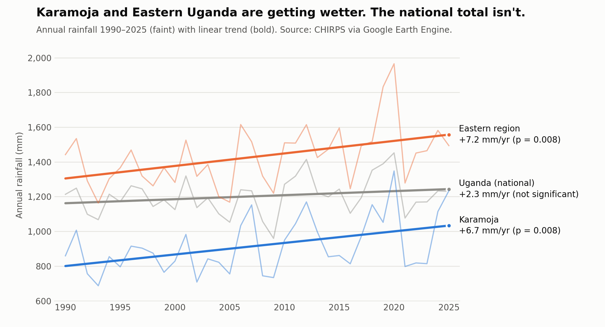

# Uganda Rainfall Variability & Drought Analysis (1990–2025)

An analysis of 36 years of monthly rainfall over Uganda using CHIRPS satellite precipitation data. It covers long-term trends, drought episodes, the two rainy seasons and decadal shifts, first at the national level and then for six regions, and finally tests how the Indian Ocean Dipole and ENSO drive the short rains.

<picture>
  <source media="(prefers-color-scheme: dark)" srcset="figures/regional_trends_dark.png">
  
</picture>

**Start here: [Synthesis report](https://tayeruta.github.io/uganda-rainfall-analysis/reports/synthesis_report.html)**, which combines all three parts and draws out what they mean for agriculture.

Individual reports: [Part 1 · National](https://tayeruta.github.io/uganda-rainfall-analysis/reports/national_report.html) · [Part 2 · Regional](https://tayeruta.github.io/uganda-rainfall-analysis/reports/regional_report.html) · [Part 3 · Indian Ocean Dipole](https://tayeruta.github.io/uganda-rainfall-analysis/reports/iod_report.html)

**Follow-on projects** build on these rainfall results:
- [Rainfall shocks and food prices](https://github.com/TayeRuta/uganda-food-prices): WFP market prices against rainfall and the Indian Ocean Dipole
- [Uganda coffee](https://github.com/TayeRuta/uganda-coffee): exports, prices, climate exposure and a global benchmark
- [Uganda irrigation](https://github.com/TayeRuta/uganda-irrigation): where irrigation is needed and where water is within reach
- [Uganda food trade](https://github.com/TayeRuta/uganda-food-trade): staple food trade with neighbouring countries, source gaps and price links

## Key findings

**National (Part 1)**

- **No significant long-term trend** in annual rainfall (linear p = 0.14; the Kendall test agrees). The gap between the driest year (2009) and the wettest (2020) is about 500 mm, roughly 40% of an average year.
- **2009 was the worst drought on record.** On a 3-month (SPI-3) basis it lasted 8 consecutive months (April–November) and fell to −2.47σ.
- **The short rains (Sep–Nov) are trending upward**, while the long rains (Mar–May), which matter most for planting, show no trend but more year-to-year volatility.
- **Rainfall has become more erratic.** Monthly variability (CV) rose about 12% from the 1990s to the 2010s.
- **ENSO shows no significant effect** on short-rains totals at the national scale (p = 0.80).

**Regional (Part 2)**

- **The flat national trend hides a regional split.** Karamoja (+6.7 mm/yr, p = 0.008) and the Eastern region (+7.2 mm/yr, p = 0.008) are getting significantly wetter. The other regions show no significant trend.
- **The wetting comes from the short rains.** Karamoja's Sep–Nov trend (+3.5 mm/yr, p = 0.0015) is the strongest result in the project.
- **Karamoja is the driest and most volatile region.** It averages 917 mm a year, and its annual totals vary about twice as much as the national average.
- **The 2009 drought hit the north hardest.** It ran 9 months in the Northern region, the longest regional drought since 1990.
- **ENSO still shows no effect at the regional scale** using September–November (revised in Part 3).

| Region | Mean annual (mm) | Annual CV | Trend (mm/yr) | Trend p |
|---|---:|---:|---:|---:|
| Eastern | 1,431 | 12.1% | +7.2 | 0.008 |
| Central | 1,209 | 9.2% | +2.2 | 0.22 |
| Northern | 1,160 | 10.7% | +1.4 | 0.50 |
| Western | 1,141 | 7.4% | +1.3 | 0.36 |
| Lake Victoria basin | 1,101 | 8.9% | +2.3 | 0.15 |
| Karamoja | 917 | 17.5% | +6.7 | 0.008 |
| **Uganda (national)** | **1,203** | **8.8%** | **+2.3** | **0.18** |

**Indian Ocean Dipole (Part 3)**

- **The IOD drives much of the short rains' year-to-year swings.** Using October–December rainfall, the IOD index correlates significantly with five of seven series (national r = 0.50, p = 0.002), most strongly in Central (r = 0.59) and the Lake Victoria basin (r = 0.54).
- **ENSO acts mainly through the IOD.** With the IOD held fixed, ENSO's correlation with the short rains falls to near zero everywhere.
- **The earlier ENSO null result was partly a window artefact.** September–November leaves out December, when much of the extra rain in strong events falls. 1997 was +36% nationally in Oct–Dec but only +4% in Sep–Nov.
- **Positive-IOD seasons averaged 18% wetter nationally** (+9% to +25% by region), but the signal leans on strong events: without 1997 and 2019 the correlations fall by about 40%.
- **The IOD also shapes the June–August rains**, the main growing period in the north and northeast. With El Niño held fixed, it correlates with mid-year rain in every region (partial r = 0.33–0.49), and this signal is robust to removing extreme years.
- **The IOD does not explain Karamoja's wetting trend**, which stays significant after controlling for it. Neither index has any link to the long rains (Mar–May).

**Synthesis (all parts)**

- **Bad seasons are mostly nationwide.** Regional seasonal totals correlate at 0.71–0.75 on average, so regions rarely offset each other.
- **The two rainy seasons are independent.** A poor March–May season says little about October–December.
- **The short rains are the riskier season but the forecastable one.** They vary by 20% a year nationally (13% for the long rains), and the July–August IOD, known by early September, cuts cross-validated forecast error by about 20% in Central and the Lake Victoria basin. Nothing here forecasts the long rains.
- **Karamoja's and the Eastern region's wetting falls mainly in September–October.**
- **Failed seasons were most frequent in the 2000s**, not recently, though month-to-month rainfall has become more erratic.

## Repository structure

```
.
├── data/
│   ├── external/                                   # NOAA climate indices (IOD and ENSO)
│   │   ├── dmi_monthly.csv                         # Dipole Mode Index, monthly
│   │   └── oni_seasonal.csv                        # Oceanic Niño Index, 3-month seasons
│   ├── raw/                                        # exported from Google Earth Engine
│   │   ├── uganda_monthly_rainfall.csv             # national average, 1990–2025
│   │   └── uganda_rainfall_by_region_1990_2025.csv # 6 regions + national reference
│   └── processed/
│       ├── regional_summary.csv                    # every metric per region (pipeline)
│       ├── regional_droughts.csv                   # top 5 SPI-3 droughts per region (pipeline)
│       ├── regional_results.json                   # full results + monthly series behind the regional report
│       ├── uganda_rainfall_regional_summary.csv    # headline stats per region (notebook 02)
│       ├── uganda_rainfall_regional_droughts.csv   # top 3 droughts per region (notebook 02)
│       ├── iod_*.csv                               # correlation and trend tables (notebook 03)
│       └── *_data.json                             # data behind the Part 3 and synthesis reports
├── notebooks/
│   ├── 01_national_analysis.ipynb   # Part 1: national trends, droughts, seasons, ENSO
│   ├── 02_regional_analysis.ipynb   # Part 2: the same analysis, per region
│   └── 03_iod_analysis.ipynb        # Part 3: Indian Ocean Dipole vs ENSO and the short rains
├── figures/                         # README figure (light and dark versions)
├── reports/
│   ├── synthesis_report.html        # all three parts combined, with agricultural implications
│   ├── national_report.html         # standalone write-up of Part 1
│   ├── regional_report.html         # standalone write-up of Part 2
│   └── iod_report.html              # standalone write-up of Part 3
├── scripts/
│   ├── gee/
│   │   ├── uganda_national_rainfall_gee.js   # Earth Engine export → data/raw/uganda_monthly_rainfall.csv
│   │   └── uganda_regional_rainfall_gee.js   # Earth Engine export → data/raw/uganda_rainfall_by_region_1990_2025.csv
│   ├── fetch_climate_indices.py     # downloads the NOAA indices → data/external/
│   ├── regional_pipeline.py         # regional analysis as a script → data/processed/regional_*
│   ├── make_readme_figure.py        # builds the figures/ chart from regional_results.json
│   └── build_report_data.py         # computes every number in the Part 3 and synthesis reports
├── LICENSE
└── requirements.txt
```

## Workflow

1. **Export:** run the scripts in `scripts/gee/` in the [Earth Engine Code Editor](https://code.earthengine.google.com/) and start the export from the Tasks tab. Each one writes a CSV to Google Drive, which goes in `data/raw/`.
2. **Climate indices:** `python scripts/fetch_climate_indices.py` downloads the latest IOD and ENSO indices from NOAA into `data/external/`.
3. **Analyse:** the notebooks in `notebooks/` contain the full analysis with a written finding after each step. `scripts/regional_pipeline.py` runs the regional analysis non-interactively and writes the tables and JSON in `data/processed/`.
4. **Report:** the HTML pages in `reports/` present the results. `python scripts/build_report_data.py` recomputes and refreshes the numbers in the Part 3 and synthesis reports.

## Data

- **Period:** January 1990 to December 2025, with 432 months per series and no gaps.
- **Processing:** daily CHIRPS rainfall is summed to monthly totals, then averaged over each boundary at CHIRPS's native ~5.5 km resolution.
- **Masking:** permanent open water (JRC occurrence ≥ 50%) is masked in the regional dataset because CHIRPS is weak over lakes. As a result, the national figures differ slightly between Part 1 and Part 2. Set `MASK_WATER = true` in the national script to match.

### Data sources

The rainfall CSVs in this repo are derived statistics. No boundary files or raw imagery are redistributed. Rainfall and boundary datasets were accessed through the Google Earth Engine data catalog; the climate indices come directly from NOAA.

| Dataset | Used for | Provider | Terms |
|---|---|---|---|
| [CHIRPS Daily v2.0](https://developers.google.com/earth-engine/datasets/catalog/UCSB-CHG_CHIRPS_DAILY) | Rainfall | Climate Hazards Center, UC Santa Barbara | Public domain (CC0) |
| [FAO GAUL 2015](https://developers.google.com/earth-engine/datasets/catalog/FAO_GAUL_2015_level1) | Uganda boundary, Karamoja districts | UN FAO | Non-commercial use |
| [geoBoundaries ADM1](https://www.geoboundaries.org/) | Central, Eastern, Northern, Western regions | William & Mary geoLab | Open license, attribution required |
| [HydroSHEDS / HydroBASINS](https://www.hydrosheds.org/) | Lake Victoria basin | WWF | Free use with attribution |
| [JRC Global Surface Water](https://global-surface-water.appspot.com/) | Open-water mask | European Commission JRC | Free use with attribution |
| [Dipole Mode Index (HadISST1.1)](https://psl.noaa.gov/gcos_wgsp/Timeseries/DMI/) | Indian Ocean Dipole | NOAA Physical Sciences Laboratory | US Government work, public domain |
| [Oceanic Niño Index (ERSSTv5)](https://www.cpc.ncep.noaa.gov/products/analysis_monitoring/ensostuff/ONI_v5.php) | ENSO | NOAA Climate Prediction Center | US Government work, public domain |

**Citations**

- Funk, C. et al. (2015). The climate hazards infrared precipitation with stations — a new environmental record for monitoring extremes. *Scientific Data* 2, 150066.
- Runfola, D. et al. (2020). geoBoundaries: A global database of political administrative boundaries. *PLoS ONE* 15(4), e0231866.
- Lehner, B. & Grill, G. (2013). Global river hydrography and network routing: baseline data and new approaches to study the world's large river systems. *Hydrological Processes* 27(15), 2171–2186.
- Pekel, J.-F. et al. (2016). High-resolution mapping of global surface water and its long-term changes. *Nature* 540, 418–422.
- Saji, N. H. et al. (1999). A dipole mode in the tropical Indian Ocean. *Nature* 401, 360–363.
- Rayner, N. A. et al. (2003). Global analyses of sea surface temperature, sea ice, and night marine air temperature since the late nineteenth century. *Journal of Geophysical Research* 108(D14), 4407.
- Huang, B. et al. (2017). Extended Reconstructed Sea Surface Temperature, Version 5 (ERSSTv5). *Journal of Climate* 30(20), 8179–8205.

## Methods

- **Trend tests:** OLS linear regression on annual and seasonal totals, checked with the Mann-Kendall (Kendall's tau) test.
- **Droughts:**
  - Standardized monthly anomalies.
  - An SPI-3 approximation (rolling 3-month standardized deficit) to measure how long droughts last.
- **Seasonality and change over time:**
  - Monthly climatology.
  - Comparison of the long rains (MAM) and short rains (SON).
  - Decadal means and coefficient of variation.
  - Trend/seasonal/residual decomposition.
- **Teleconnections:**
  - Parts 1–2: comparison of El Niño, La Niña and neutral years.
  - Part 3: correlation of seasonal rainfall with the IOD (DMI) and ENSO (ONI) indices, partial correlations to separate the two, composites by IOD phase, and trend regressions that control for the IOD.
- **Forecast skill (synthesis):** leave-one-out cross-validated regression of October–December rainfall on the July–August and September IOD, scored by error reduction against climatology and tercile hit rate.
- **Regional coherence and season links (synthesis):** correlations between regions' seasonal totals, and between consecutive seasons.
- **Persistence:** autocorrelation of monthly anomalies.
- **Multiple testing:** about 35 tests were run in Part 2 and 91 in Part 3, so results near p ≈ 0.04 are treated as suggestive. Key results are checked against a Bonferroni threshold (Part 2) and the Benjamini–Hochberg false discovery rate (Part 3).

## Reproducing the analysis

```bash
git clone https://github.com/TayeRuta/uganda-rainfall-analysis.git
cd uganda-rainfall-analysis
python -m venv .venv && source .venv/bin/activate
pip install -r requirements.txt
jupyter notebook notebooks/
```

Run the notebooks from inside `notebooks/`, because the data paths are relative to that folder. The pipeline script can be run from anywhere:

```bash
python scripts/regional_pipeline.py
```

The HTML reports in `reports/` open directly in a browser, or online via the links at the top.

## Limitations

- CHIRPS is a satellite–gauge blend. It is less reliable over open water and complex terrain, and it is not a substitute for station records.
- The four administrative regions stand in for agro-ecological zones.
- The IOD and ENSO overlap heavily: all six positive-IOD seasons since 1990 coincided with El Niño, so the two can be separated only partly.
- 36 years contain few strong IOD events, and the IOD signal depends heavily on two of them (1997 and 2019).
- Karamoja's wetting trend remains unexplained. Checking it against station records or a second rainfall product (ERA5, TAMSAT) is the natural next step.

## License

The code and analysis in this repository are released under the [MIT License](LICENSE). The source datasets keep their own terms (see [Data sources](#data-sources)).
